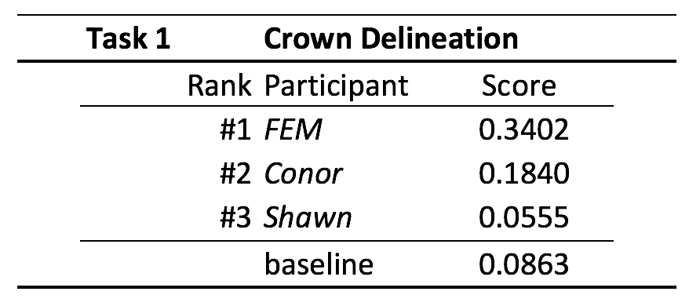

## Results - 2017

The results of the 2017 competition have now been published as [a paper collection](https://peerj.com/collections/56-remotesensingcomp/). The main results are described in [the central paper](https://doi.org/10.7717%2Fpeerj.5843) and the details are available in papers by the participants in the collection. The main score comparisons for the primary tasks are listed below.

### Task 1: Delineation

Congratulation to FEM group! They showed that  the method 4 of Dalponte et al. 2015 (itcIMG of the itcSegment R package) was the best method out of the three applied to the dataset (Table 1). 

*Table 1. Scoring table. Participants have been ranked by the pairwise Jaccard Coefficient.*

### Task 2: Alignment

Congratulation to FEM group! They showed that the Euclidean distance between ground points and the ITCs, was the best method out of the two applied to the dataset (Table 2). The distance was calculated on four axes: X coordinate, Y coordinate, the height and the crown radius.  

*Table 2. Scoring table. Participants have been ranked by the trace of the prediction matrix, divided by the sum over the values in that matrix.*

### Task 3: Classification

Congratulation to StanfordCCB group! They showed that a three step process was the best method applied to the data: (1) dimensionality reduction; (2) multi-label classification algorithms, and; (3) ensembles (Table 3).  

*Table 3. Scoring table. Participants have been ranked by the cross entropy cost. Rank-1 Accuracy provided in the forth column.*
