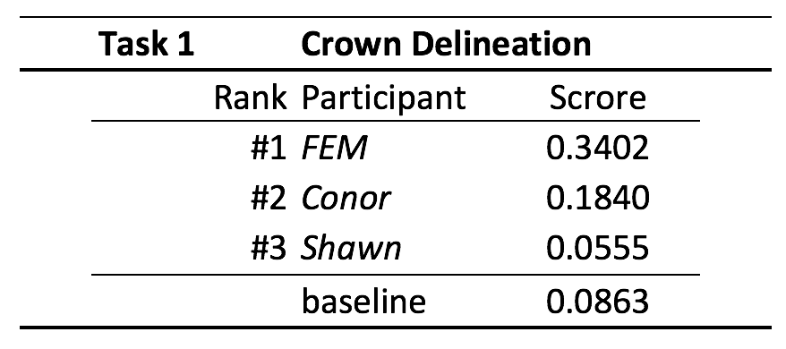
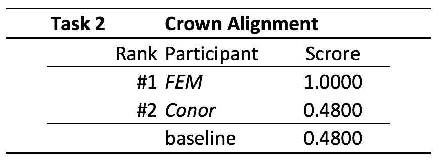
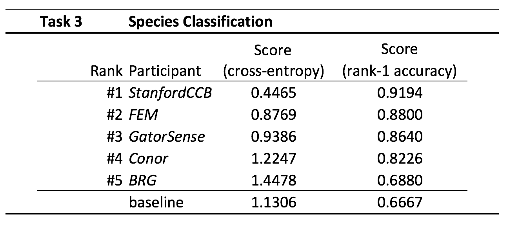

### Congratulation everybody!

It was fun, and it couldn't have been nicer as a pre pilot! We will be running the competition again next year, and we hope to have you all benchmarching your algorithms to our old and new data!

Now, I am happy to declare winners and scores of everybody competing: Congratulations to the FEM and the StanfordCCB groups!

### Task 1: Delineation

Congratulation to FEM group! They showed that  the method 4 of Dalponte et al. 2015 (itcIMG of the itcSegment R package) was the best method out of the three applied to the dataset (Table 1).

*Table 1. Scoring table. Participants have been ranked by the pairwise Jaccard Coefficient.*

### Task 2: Alignment

Congratulation to FEM group! They showed that the Euclidean distance between ground points and the ITCs, was the best method out of the two applied to the dataset (Table 2). The distance was calculated on four axes: X coordinate, Y coordinate, the height and the crown radius.  

*Table 2. Scoring table. Participants have been ranked by the trace of the prediction matrix, divided by the sum over the values in that matrix.*

### Task 3: Classification

Congratulation to StanfordCCB group! They showed that a three step process was the best method applied to the data: (1) dimensionality reduction; (2) multi-label classification algorithms, and; (3) ensembles (Table 3).  

*Table 3. Scoring table. Participants have been ranked by the cross entropy cost. Rank-1 Accuracy provided in the forth column.*
