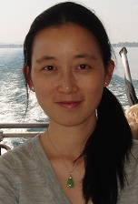
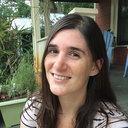

### Data Science Research lab

https://dsr.cise.ufl.edu/daisyw/

Daisy Zhe Wang: 

Daisy Zhe Wang is an Associate Professor in the CISE department at the University of Florida, and directs the Data Science Research lab.

Dihong Gong: 

Dihong is a PhD candidate at University of Florida, advised by Dr Wang. 

### Stephanie Bohlman's lab

http://sfrc.ufl.edu/people/faculty/bohlman/

Stephanie Bohlman:

Stephanie Bohlman is an Assistant Professor in the Forest Resources and Conservation department at the University of Florida, and directs the Bohlman lab.

Sarah Graves:

Sarah J Graves currently is a PhD Candidate at the School of Forest Resources and Conservation, University of Florida, and currently works at University of Wisconsin Madison. She is advised by Dr Bohlman.

### WEecology lab

http://weecology.org

Ethan White:

Ethn White is  an Associate Professor, Dept. Wildlife Ecology & Conservation, University of Florida. He is a cofounder of the WEecology lab, and is interested in data-intensive questions in ecology, using large ecological datasets, advanced statistical/machine learning methods, and theoretical modeling to understand ecological patterns.

Sergio Marconi

Sergio Marconi is currently a PhD student in Interdisciplinary Ecology at University of Florida. He is interesting in predicting functional patterns of vegetation, and is advised by Dr White.
