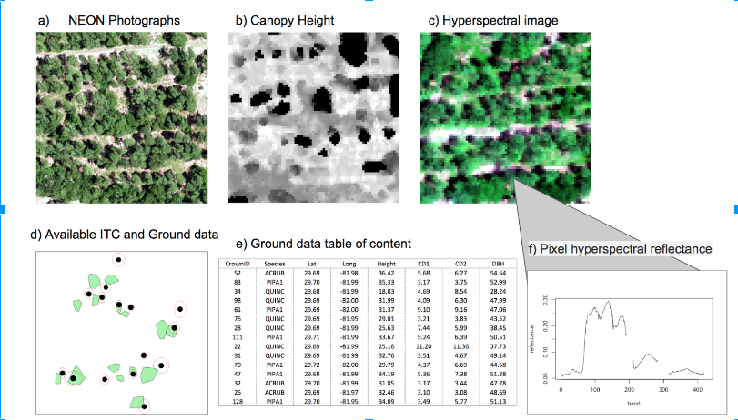

## IDTreeS data science challenge

Understanding and managing forests is crucial to understanding and potentially
mitigating the effects of climate change, invasive species, and shifting land
use on natural systems and human society. However, collecting data on individual
trees in the field is expensive and time consuming, which limits the scales at
which this crucial data is collected. Remotely sensed imagery from satellites,
airplanes, and drones provide the potential to observe ecosystems at much larger
scales than is possible using field data collection methods alone. This data
science competition focuses on using remote sensing data to quantify the
locations, sizes and species identities of millions of trees and on determining
how these methods generalize to other forests.

The next round of this challenge will begin in late 2019. Anyone is welcome to
participate, working as teams or individuals.

**[Sign up to receive more information in the next few weeks.](register)**

## Data

* **Airborne remote sensing**: High resolution hyperspectral imagery, higher
resolution RGB imagery, and LiDAR data on plant height.
* **Ground Data**: Ground based measurements of tree size, location, and type
* **Individual Tree Crowns**: Ground based identification of tree crowns on
  remote sensing imagery.

## Tasks

* **Crown Delineation**: Estimate the size, shape, and location of individual tree crowns
* **Classification**: determine the species identity of each tree from remotely sensed data

## Find out more

* [Enter your email](register) to hear more

## About the Data Science Challenge

* Sponsored by the National Science Foundation (NSF) through grant
  [1926542](https://www.nsf.gov/awardsearch/showAward?AWD_ID=1926542&HistoricalAwards=false)
  and the Gordon and Betty Moore Foundation’s Data-Driven Discovery Initiative
  through grant [GBMF4563](https://www.moore.org/grant-detail?grantId=GBMF4563).
* Organized by the Data Science Research lab, the WEecology lab, and Stephanie
  Bohlman's lab all at the University of Florida.
* The data is collected by National Ecological Observatory Network (NEON) from
  the Ordway-Swisher Biological Station (OSBS) NEON site and by researchers at
  the University of Florida.
