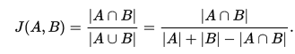

Segmentation is a common Data Science problem that involves locating objects or
boundaries in images. In addition to being useful on its own, good segmentation
is often important for classification of objects within images.

### Summary: Segmentation  
 
 `Inputs:` Hyperspectral images, RGB images, and LiDAR point cloud data.  
 `Output:` Shapefiles containing estimates of the position and shape of
 individual tree crowns (ITC data).  
 `Training Files:` ITC_OSBS_plot.shp, OSBS_plot_hyper.tiff, hyper_bands.csv,
 OSBS_plot_chm.tiff, ptcloud_plot.csv, rgb_plot.tiff.  
 `Test Files:` hyper_plot.tiff, chm_plot.tiff, ptcloud_plot.csv, rgb_plot.tiff  
 Submission File: itc_subm_plot.shp (including all 4 sub files; .shp, .shx, .dbf, .prj)

### 3.1 Segmentation in the ecology domain

Identifying the position and size of individual trees from remote sensing is
useful for understanding forest structure and an important first step in species
classification. It is also a complex version of the common image segmentation
task because trees often overlap each other and look similar, and because the
available data is heterogeneous, involving many bands, multiple resolutions, and
point cloud height data. Participants will use Hyperspectral, LiDAR and high
resolution RGB photographs to locate and segment individual crowns in multiple
plots.

### 3.2 Training Data

Input for the training phase will be data for a subset of plots at Ordway
Swisher and will include shapefiles with polygons for each individual tree crown
(ITC) along with associated hyperspectral, LiDAR, and RGB data. LiDAR data
provides information on the spatial variation in canopy height that may allow
partitioning of crowns of neighboring trees with similar spectral
signatures. Hyperspectral data allows development of spectral signatures to
identify object categories (e.g. by assigning spectrally-similar categories to
the same cluster). RGB photographs provide finer resolution information
(0.25x0.25 m as opposed to 1.0x1.0 m for the hyperspectral data), which may be
helpful to separate trees that are close to one another and to refine boundary
placement. Using the remote sensing data, participants will build models to
estimate crown boundaries in plots where ITC polygons are not available.  The
ITC data can be considered as ground truth, since polygons of individual crowns
were manually delineated in the field by field experts and drawn directly on
remote sensing images.  The input data consists of two types of data: a shape
file containing ITC data for 70% of the plots and remote sensing data for all
plots, including one of the following for each plot: Hyperspectral (geotiff
format), LIDAR (geotiff and csv), and RGB (geotiff). File naming will be of the
form itc_train_*plot*.shp, hyper_*plot*.tiff, chm_*plot*.tiff, ptcloud_*plot*.csv,
rgb_*plot*.tiff where plot indications the numeric code of the plot of each plot.

* In each ITC shape file, each attribute will be an individual crown and its
  associated crown ID. Each “shape file” is composed of four files (.shp, .shx,
  .dbf, .prj), which can be read with widely-available packages (including most
  GIS software and GDAL).
* Each of the geotiff files contain the values for each band, the dimensions of
  the 2D or 3D space, and the spatial location information.
   * `Hyperspectral` - 426 bands on an 80 x 80 pixel lattice at 1 m2 resolution
   * `CHM` (canopy height model) - 1 band on an 80 x 80 pixel lattice at 1 m2 resolution
   * `RGB` - 3 bands on a 320 x 320 pixel lattice at 0.0625 m2 resolution
* Information on hyperspectral bands, including which bands should be ignored,
  will be provided in a 3 column csv file named hyper_bands.csv.
   * `band_name`: the name of the band formatted as band_number
   * `nanometer`: the spectrum value
   * `noise`: 0 indicates that the band is good to use, 1 indicates that it is
     strongly influenced by the absorbance of atmospheric water and should be
     excluded from most analyses
* The point cloud data will be provided as a 3 column csv file with the *x*,
  *y*, and *z* coordinates of of each LIDAR return/point.
   * `x`: utm coordinates *m*
   * `y`: utm coordinates in *m*
   * `z`: height in m above sea level

### 3.3 Test Data

Data provided for testing will be the hyperspectral, LiDAR, and RGB data
described above for the plots not provided in the training dataset. ITC data
will not be provided for the test set, as the goal is for participants to
predict its contents from the remote sensing data.

### 3.4 Submission Data

The submission files will include one shape file (including all 4 subfiles) for
each test plot named as itc_subm_*plot*.shp.

* In the ITC shape file, each attribute will be an individual crown and a unique crown ID.

### 3.5 Performance Metrics

Participants’ performance on each plot will be calculated as the mean pairwise
Jaccard Coefficient, J(A,B), calculated for each predicted polygon with the
corresponding ground truth polygon. When there is ambiguity with regard to which
submitted polygon corresponds to which ITC, we will choose the mapping that
gives the best score to the participant.

The score for this task is the average of the plot level scores, which are
themselves the average scores of the polygons within each plot.  This method is
simple, does not require assignment of predicted crowns to specific ITCs by the
participants, and has good continuity since the Jaccard coefficient has good
continuity.  The output for the crown delineation algorithm is expected to
produce polygons with no overlap, but if there are cases of overlapping crowns
in the submitted polygons, they will be disambiguated by disregarding the
intersection in the numerator of the Jaccard Coefficient. Thus, it is in the
participant’s best interest to remove areas of intersection by dividing those
areas among the overlapping crowns.
