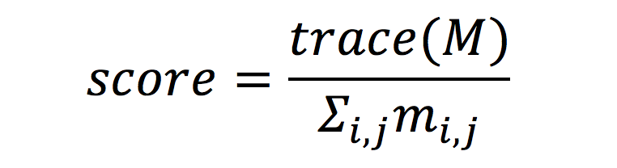

### Alignment

Alignment is a common Data Science problem that involves associating two or more representations of the same object. One common instance of this problem is identifying the same object in data collected from different instruments or data sources.

### Summary: Alignment
`Inputs:` ITC data, Ground data. Optional: Hyperspectral images, RGB images, LiDAR data
`Output:` Labels relating the ITC crown ID to the Ground data stem ID for each tree
`Training Files:` ground_train.csv, itc_ground_relation_train.csv, Optional: hyper_plot.tiff, hyper_bands.csv, chm_plot.tiff, ptcloud_plot.csv, rgb_plot.tif
`Test Files:` itc_ground_relation_test.shp, ground_test.csv, Optional: hyper_plot.tiff, chm_plot.tiff, ptcloud_plot.csv, rgb_plot.tiff
`Submission Files:` itc_ground_relation_subm_plot.csv

### 4.1 Alignment in the ecology domain
To build models relating remote sensing to field data, it is necessary to align the ground data to the remote sensing images. The three remote sensing datasets have been georeferenced and pre-aligned with one another by NEON. The NEON Ground data are georeferenced separately from the remote sensing data using a combination of GPS locations for fixed points and surveying methods to relate tree locations to those fixed points. Both the remote sensing and ground data coordinates  involve measurement error, with the error likely being greater in the ground data. In addition, the ground data provides a location for the trunk of the tree, which is not directly visible in the remote sensing data. The trunk is not always located at the center of the crown because crowns are positioned in part to maximize light capture and avoid other tree crowns. As a consequence, apparent positions of trees can differ between the ground and remote sensing data sources with offsets of up to several meters even when no other errors have occurred with geo-referencing. Such offsets make it more difficult to develop models that related the ground and remote sensing data.
The goal of the task is to correctly align each tree crown polygon to a single tree from the ground data, thus allowing data collected on the ground (e.g. species identity, height, stem diameter) to be accurately associated with remote sensing data. This can be accomplished by considering the position and size of stems and crowns. Other information from the remote sensing images may also be helpful.
In real world situations this task will typically be conducted in an unsupervised manner matching segmented crowns to ground data using tree location and size without the use of ITC data for either training or evaluation. In this DSE we have collected ITC data to allow us to:
* make this task independent of the segmentation task by providing the ITC segmentation as a near perfect segmentation of the image;
*  evaluate the performance of the algorithms against the known mapping between the ITC crowns and the ground data stems;
* provide data that allows for supervised rather than unsupervised algorithm development.

### 4.2 Training Data

Input data will be for a subset of plots and will include ITC polygon data, NEON ground data (including the stem ID, location of the stem, diameter of the stem, and for some of the plots the maximum crown radius and the radius perpendicular to the axis of the maximum radius). Only ITC polygon data for which ground data is available will be included. The stem diameter of trees is positively related to the crown diameter, which should allow the size of the crown to be estimated from the diameter of the stem in cases where the crown diameter is not measured directly. The remote sensing data (Hyperspectral, RGB, and LiDAR) will also be available for optional use.
The primary input data consists of the ground and ITC data for 70% of the training plots from the segmentation task and will include:   1) one csv file (*ground.csv*) containing information on the location, stem size, crown size, and stem ID of each tree;   2) one csv ( *itc_attributes.csv*) with attributes and centroid coordinates for each individual tree crown (ITC); and 3) one csv file per plot containing the stem ID and associated crown ID for each tree (*itc_ground_relation_ train.csv*). The hyperspectral, canopy height, and camera data described in 3.2 will also be provided for optional use. The goal is to match stem ID from the ground data to the crown ID for the ITC tree crowns.

* Each ground csv file contains these comma separated fields:
   * `stem_id`: a unique identifier, corresponding to NEON tags on ground data
   * `tag_E`: utm coordinates in m collected on the ground
   * `tag_N`: utm coordinates in m collected on the ground
   * `diameter`: diameter of the stem in cm at a standard height above the ground (~1.3 m)
   * `height`: height of the tree measured from the ground. Empty when missing value
   * `cr_max`: maximum radius of the crown in m
   * `cr_perp`: radius of the crown in m in the direction perpendicular to the maximum radius
* Each itc_attributes csv file contains these comma separated fields:
   * `Plot_id`: name of the plot from which data have been collected
   * `ITC_id`: a unique identifier assigned to each itc polygon, and uncorrelated to stem_id
   * `ITC_E`:  itc centroid utm coordinates in m
   * `ITC_N`:  itc centroid utm coordinates in m
* Each itc_ground_relation relation file contains these comma separated fields
   * `stem_id`: the stem ID from the ground data
   * `crown_id`: the matching crown ID from the ITC data

### 4.3 Test Data

Data provided for testing will be the ground and ITC attribute data (and optionally the remote sensing data) for the 30% of the training plots from the segmentation task not provided in the training dataset. Relationship data will not be provided for the test set.

### 4.4 Submission Data
The submission files will include one *csv* file for each test plot named *itc_ground_relation_subm_plot.csv*. Each file must contain these comma separated fields
* `stem_id`: the stem ID from the ground data
* `crown_id`: the matching crown ID from the ITC data
* `probability`: the probability that the stem_id matches to the crown_id. The probabilities for a given stem_id will be normalized to sum to 1 if the submitted values do not already.

### 4.5 Performance Metrics
Performance of the pairing of field stems to ITC crowns will be evaluated using the trace of the prediction matrix divided by the sum over the values in that matrix. This method was chosen based on the following reasoning. In the testing stage, suppose we have a set of probe data (ITC) denoted as {pn|n=1,..,N}, and ground truth data denoted as {gn|n=1,..,N},. We know in advance that there is a unique one-to-one mapping between P and G sets. Without loss of generality, assume pn should be mapped to gn for n=1,..,N. For each probe data point pi, a program predicts a non-negative confidence score that  should be aligned with ground truth data point gj, which forms a prediction matrix M = (mi,j) where i,j = 1,...,N. Then, the quality of prediction can be measured by the following scoring function:

where trace(∙) represents trace of a matrix and M represents the prediction matrix which has been aligned in the order which matches the ground truth.
