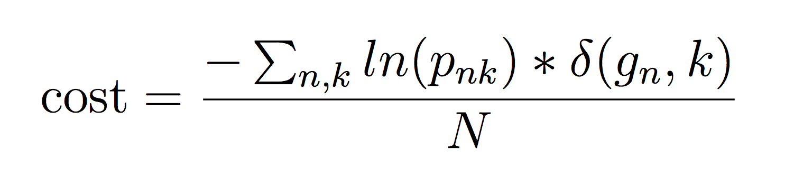

### 5 Classification
Classification is a common Data Science problem that involves determining which of a set of categories an object belongs to.

### Summary: Classification

`Inputs:` Ground data on species and genus IDs combined with Hyperspectral and CHM values for each pixel within the ITC for the tree
`Output:` A probability that each tree belongs to each possible species
`Training Files:` species_id_train.csv, crown_hyper_train.csv, hyper_bands.csv
`Test Files:` crown_hyper_test.csv
`Submission Files:` species_id_subm.csv

### 5.1 Classification in the ecology domain
A large number of ecological, environmental, and conservation oriented questions depend on species identification. This includes efforts to conserve individual species, understand and maintain biodiversity, and incorporate the biosphere into global circulation models. Being able to describe the density and distribution of different species using remote sensing would allow these efforts to occur more rapidly and at larger scales than field sampling. The goal of this task is to classify trees in remote sensing data into species and genera (higher level groupings of species). In addition to its utility for the domain, this task represents a challenging version of general classification problems because it involves classifying different species with very similar spectral signatures and categorizing data where some categories (species) have only small samples in the training set (i.e. rare species).
This task involves using the Hyperspectral and CHM data from LIDAR to build classifiers for the ground based species identifications. To make this task independent of the segmentation and alignment tasks, and to maximize sample size, pre-aligned ITC data will be used to extract pixel level Hyperspectral an dCHM data for each pixel in all trees to be classified. Participants will determine probability that each tree belongs to each species and genus. Spectral reflectance signatures are the most commonly used data type for building species classifiers. Since classification is at the level of the crown, any pixel-level classification models must be upscaled to the crown.

One important criterion for evaluating a classification model is its ability to deal with species (or genera) from outside the training set.  Thus, we also evaluate participants’ classification models on their ability to correctly classify crowns as “Other” when they do not belong to any of the previously seen classes. The “Other” label may appear at only the species level (if the new species belongs to an existing genus) or at both the species and genus levels (if the new species belongs to a new genus). Since the “Other” class will include a diverse group of species, it will include a broader range of spectral signatures than the known classes will, providing an additional challenge for classification. Any class (genus or species) with less than 5 individuals in the full dataset is categorized as “Other” in both the test and training sets.

### 5.2 Training Data

Input data will be for 70% of the trees in the ITC data for which species were identified on the ground. Data will be provided in three files: 1) a csv file named *species_id_train.csv* containing the crown ID and associated genus and species for each tree; 2) a csv file named *crown_hyper_train.csv* containing the crown ID, canopy height (from the CHM data) and 426 hyperspectral bands for each pixel occurring within each crown; and 3) a csv file named *hyper_bands.csv* containing information on the hyperspectral bands. The goal is to determine the species and genus from the hyperspectral and CHM data for each crown.

* The species ID file contains these comma separated fields
   * `crown_id:` the matching crown ID from the ITC data
   * `genus:` the genus of the tree
   * `species:` the species of the tree
   * `genus_id:` a unique two letter code for each genus
   * `species_id:` a unique four letter code for each species
* The hyperspectral data file contains a total of 428 columns and one row per pixel
   * `crown_id:` the matching crown ID from the ITC data
   * `canopy_height:` the height of the tree in m above ground
   * `426 bands` columns with hyperspectral band intensities named: band_1, band_2 … band_426
* Information on hyperspectral bands, including which bands should be ignored, will be provided in a 3 column csv file named hyper_bands.csv.
   * `band_name:` the name of the band formatted as band_number
   * `Nanometer:` the average wavelength of the 5nm wide ith spectral band
   * `noise:` 0 indicates that the band is good to use, 1 indicates that it is strongly influenced by the absorbance of atmospheric water and should be excluded from most analyses

### 5.3 Test Data

Test data will include the non-training hyperspectral data and the data on the hyperspectral bands.

### 5.4 Submission Data
Submissions will be two csv files named species_id_subm.csv and genus_id_subm.csv containing information on the crown ID and the species and genus identification probabilities for each crown. These files must contain these comma separated fields
* `crown_id:` the matching crown ID from the ITC data
* `ID:` the predicted genus or species ID (or “Other”)
* `probability:` the probability that the crown belongs to the associated genus or species. The probabilities for a given crown_id (including the “Other” category) will be normalized to sum to 1 if the submitted values do not already.

The files should contain one row for each possible crown_id and genus/species combination(i.e., the number of rows should be equal to the number of crown_id’s in the test set times the number of unique IDs (either species or genus) present in the training set). The results should be sorted in ascending order by crown_id and then ID. The dictionary of genus/species classes and their unique IDs will be provided. The performance metrics will be computed separately for genus and species classes.
### 5.5 Performance Metrics
We will evaluate performance using two metrics. The first one, rank-1 accuracy, is the fraction of crowns in the test set whose ground truth species_id (or genus_id) was assigned the highest probability by the participant. It is calculated as mean(argmax_k(p_{ik})==g_i), where g_i is the ground-truth class of crown i, and  p_{ik} is the probability assigned by the participant that crown i belongs to class k. This metric only considers whether the correct class has the highest probability, not whether the probabilities are well-calibrated.
The second metric, average cross-entropy, is defined as:

given that pnk ≠ 0, to avoid the singularity. The δ(x, y) is an indicator function that takes value 1 when x = y. This metric rewards participants for submitting well-calibrated probabilities that reflect their uncertainty about which crowns belong to which class.
Performance metrics will be evaluated on the two different class labels (genus and species) separately, resulting in four separate scores. Note that the “Other” label will be included alongside the biological species and genus names in calculating these performance metrics.
